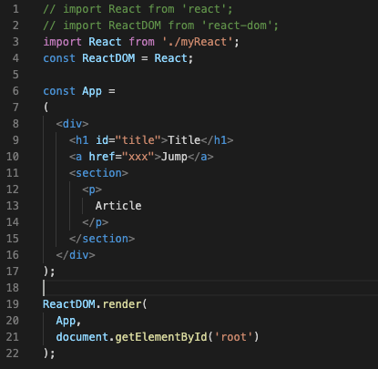

熟悉React的朋友都知道，React支持jsx语法，我们可以直接将HTML代码写到JS中间，然后渲染到页面上，我们写的HTML如果有更新的话，React还有虚拟DOM的对比，只更新变化的部分，而不重新渲染整个页面，大大提高渲染效率。到了16.x，React更是使用了一个被称为`Fiber`的架构，加快了虚拟DOM的对比速度，同时还引入了`hooks`等特性。那隐藏在React背后的原理是怎样的呢，`Fiber`和`hooks`又是怎么实现的呢？本文会从`jsx`入手，手写一个简易版的React，并且实现`Fiber`和`hooks`等特性，从而深入理解React的原理。

## JSX和creatElement

以前我们写React要支持JSX还需要一个库叫`JSXTransformer.js`，后来JSX的转换工作都集成到了babel里面了，babel还提供了[在线预览的功能](https://babeljs.io/repl)，可以看到转换后的效果，比如下面这段简单的代码:

```jsx
const App =
(
  <div>
    <h1 id="title">Title</h1>
    <a href="xxx">Jump</a>
    <section>
      <p>
        Article
      </p>
    </section>
  </div>
);
```

经过babel转换后就变成了这样：


上面的截图可以看出我们写的HTML被转换成了`React.createElement`，我们将上面代码稍微格式化来看下：

```javascript
const App = React.createElement(
  'div',
  null,
  React.createElement(
    'h1',
    {
      id: 'title',
    },
    'Title',
  ),
  React.createElement(
    'a',
    {
      href: 'xxx',
    },
    'Jump',
  ),
  React.createElement(
    'section',
    null,
    React.createElement('p', null, 'Article'),
  ),
);
```

从转换后的代码我们可以看出`React.createElement`支持多个参数:

> 1. type，也就是节点类型
> 2. config, 这是节点上的属性，比如`id`和`href`
> 3. children, 从第三个参数开始就全部是children也就是子元素了，子元素可以有多个，类型可以是简单的文本，也可以还是`React.createElement`，如果是`React.createElement`，其实就是子节点了，子节点下面还可以有子节点。这样就用`React.createElement`的嵌套关系实现了HTML节点的树形结构。

让我们来完整看下这个简单的React页面代码：


渲染在页面上是这样：


这里面用到了React的地方其实就两个，一个是JSX，也就是`React.createElement`，另一个就是`ReactDOM.render`，所以我们手写的第一个目标就有了，就是`createElement`和`render`这两个方法。

### 手写createElement

对于`<h1 id="title">Title</h1>`这样一个简单的节点，原生DOM也会附加一大堆属性和方法在上面，所以我们在`createElement`的时候最好能将它转换为一种比较简单的数据结构，只包含我们需要的元素，比如这样：

```javascript
{
  type: 'h1',
  props: {
    id: 'title',
    children: 'Title'
  }
}
```

有了这个数据结构后，我们对于DOM的操作其实可以转化为对这个数据结构的操作，新老DOM的对比其实也可以转化为这个数据结构的对比，这样我们就不需要每次操作都去渲染页面，而是等到需要渲染的时候才将这个数据结构渲染到页面上。这其实就是虚拟DOM！而我们`createElement`就是负责来构建这个虚拟DOM的方法，下面我们来实现下：

```javascript
function createElement(type, props, ...children) {
  // 核心逻辑不复杂，将参数都塞到一个对象上返回就行
  // children也要放到props里面去，这样我们在组件里面就能通过this.props.children拿到子元素
  return {
    type,
    props: {
      ...props,
      children
    }
  }
}
```

上述代码是React的`createElement`简化版，对源码感兴趣的朋友可以看这里：[https://github.com/facebook/react/blob/60016c448bb7d19fc989acd05dda5aca2e124381/packages/react/src/ReactElement.js#L348](https://github.com/facebook/react/blob/60016c448bb7d19fc989acd05dda5aca2e124381/packages/react/src/ReactElement.js#L348)

### 手写render

上述代码我们用`createElement`将JSX代码转换成了虚拟DOM，那真正将它渲染到页面的函数时`render`，所以我们还需要实现下这个方法，通过我们一般的用法`ReactDOM.render( <App />,document.getElementById('root'));`可以知道他接收两个参数：

> 1. 跟组件，其实是一个JSX组件，也就是一个`createElement`返回的虚拟DOM
> 2. 父节点，也就是我们要将这个虚拟DOM渲染的位置

有了这两个参数，我们来实现下`render`方法：

```javascript
function render(vDom, container) {
  let dom;
  // 检查当前节点是文本还是对象
  if(typeof vDom === 'string') {
    dom = document.createTextNode(vDom)
  } else {
    dom = document.createElement(vDom.type);
  }

  // 将vDom上除了children外的属性都挂载到真正的DOM上去
  if(vDom.props) {
    Object.keys(vDom.props)
      .filter(key => key != 'children')
      .forEach(item => {
        dom[item] = vDom.props[item];
      })
  }
  
  // 如果还有子元素，递归调用
  if(vDom.props && vDom.props.children && vDom.props.children.length) {
    vDom.props.children.forEach(child => render(child, dom));
  }

  container.appendChild(dom);
}
```

上述代码是简化版的`render`方法，对源码感兴趣的朋友可以看这里：[https://github.com/facebook/react/blob/3e94bce765d355d74f6a60feb4addb6d196e3482/packages/react-dom/src/client/ReactDOMLegacy.js#L287](https://github.com/facebook/react/blob/3e94bce765d355d74f6a60feb4addb6d196e3482/packages/react-dom/src/client/ReactDOMLegacy.js#L287)

现在我们可以用自己写的`createElement`和`render`来替换原生的方法了：



可以得到一样的渲染结果：


## 为什么需要Fiber

上面我们简单的实现了虚拟DOM渲染到页面上的代码，这部分工作被React官方称为renderer，renderer是第三方可以自己实现的一个模块，还有个核心模块叫做reconsiler，reconsiler的一大功能就是大家熟知的diff，他会计算出应该更新那些页面节点，然后将需要更新的节点虚拟DON传递给renderer，renderer负责将这些节点渲染到页面上。但是这个流程有个问题，虽然React的diff算法是经过优化的，但是他却是同步的，renderer负责操作DOM的`appendChild`等API也是同步的，也就是说如果有大量节点需要更新，JS线程的计算和渲染时间可能会比较长，在这段时间浏览器是不会响应其他事件的，因为JS线程和GUI线程是互斥的，JS运行时页面就不会响应，这个时间太长了，用户就可能看到卡顿，特别是动画的卡顿会很明显。在[React的官方演讲](http://conf2017.reactjs.org/speakers/lin)中有个例子，可以很明显的看到这种同步计算造成的卡顿：


而Fiber就是用来解决这个问题的，Fiber可以将长时间的同步任务拆分成多个小任务，从而让浏览器能够抽身去响应其他事件，等他空了再回来继续计算，这样整个计算流程就显得平滑很多。下面是使用Fiber后的效果：


## 怎么来拆分

上面我们自己实现的`render`方法直接递归遍历了整个vDom树，如果我们在中途某一步停下来，下次再调用时其实并不知道上次在哪里停下来的，不知道从哪里开始，所以vDom的树形结构并不满足中途暂停，下次继续的需求，需要改造数据结构。另一个需要解决的问题是，拆分下来的小任务什么时候执行？我们的目的是让用户有更流畅的体验，所以我们最好不要阻塞高优先级的任务，比如输入，动画之类，等他们执行完了我们再计算。那我怎么知道现在有没有高优先级任务，浏览器是不是空闲呢？总结下来，Fiber要想达到目的，需要解决两个问题：

> 1. 新的任务调度，有高优先级任务的时候将浏览器让出来，等浏览器空了再继续执行
> 2. 新的数据结构，可以随时中断，下次进来可以接着执行

### requestIdleCallback

`requestIdleCallback`是一个实验中的新API，这个API调用方式如下:

```javascript
// 开启调用
var handle = window.requestIdleCallback(callback[, options])

// 结束调用
Window.cancelIdleCallback(handle) 
```

`requestIdleCallback`接收一个回调，这个回调会在浏览器空闲时调用，每次调用会传入一个`IdleDeadline`，可以拿到当前还空余多久，`options`可以传入参数最多等多久，等到了时间浏览器还不空就强制执行了。使用这个API可以解决任务调度的问题，让浏览器在空闲时才计算diff并渲染。[更多关于requestIdleCallback的使用可以查看MDN的文档。](https://developer.mozilla.org/zh-CN/docs/Web/API/Window/requestIdleCallback)但是这个API还在实验中，兼容性不好，[React官方自己实现了一套](https://github.com/facebook/react/blob/master/packages/scheduler/src/forks/SchedulerHostConfig.default.js)。本文会继续使用`requestIdleCallback`来进行任务调度，我们进行任务调度的思想是讲任务拆分成多个小任务，`requestIdleCallback`里面不断的把小任务拿出来执行，当所有任务都执行完或者超时了就结束本次执行，同时要注册下次执行，代码架子就是这样：

```javascript
// 任务调度
let currentTask = null;
// workLoop用来调度任务
function workLoop(deadline) {
  while(currentTask && deadline.timeRemaining() > 1) {
    // 这个while循环会在任务执行完或者时间到了的时候结束
    currentTask = peekTask(currentTask);
  }

  // 如果任务还没完，但是时间到了，我们需要继续注册requestIdleCallback
  requestIdleCallback(workLoop);
}

// peekTask用来获取下个任务，参数是我们的fiber
function peekTask(fiber) {

}
requestIdleCallback(workLoop);
```

[上述代码对应React源码看这里。](https://github.com/facebook/react/blob/master/packages/scheduler/src/Scheduler.js#L164)

### Fiber可中断数据结构

上面我们的`peekTask`并没有实现，但是从上面的结构可以看出来，他接收的参数是一个小任务，同时通过这个小任务还可以找到他的下一个小任务，Fiber构建的就是这样一个数据结构。之前的数据结构是一棵树，父节点的`children`指向了子节点，但是只有这一个指针是不能实现中断继续的。比如我现在有一个父节点A，A有三个子节点B,C,D，当我遍历到C的时候中断了，重新开始的时候，其实我是不知道C下面该执行哪个的，因为只知道C，并没有指针指向他的父节点，也没有指针指向他的兄弟。Fiber就是改造了这样一个结构，加上了指向父节点和兄弟节点的指针：


上面的图片还是来自于官方的演讲，可以看到和之前父节点指向所有子节点不同，这里有三个指针：

> 1. **child**: 父节点指向第一个子元素的指针。
> 2. **sibling**：从第一个子元素往后，指向下一个兄弟元素。
> 3. **return**：所有子元素都有的指向父元素的指针。

有了这几个指针后，我们可以在任意一个元素中断遍历并恢复，比如在`List`处中断了，恢复的时候可以通过`child`找到他的子元素，也可以通过`return`找到他的父元素，如果他还有兄弟节点也可以用`sibling`找到。

## 参考资料

[A Cartoon Intro to Fiber](http://conf2017.reactjs.org/speakers/lin)

[React Fiber](https://juejin.im/post/5ab7b3a2f265da2378403e57)

[妙味课堂](https://study.miaov.com/v_show/4227)

[这可能是最通俗的 React Fiber(时间分片) 打开方式](https://juejin.im/post/5dadc6045188255a270a0f85)

[浅析 React Fiber](https://juejin.im/post/5be969656fb9a049ad76931f)

