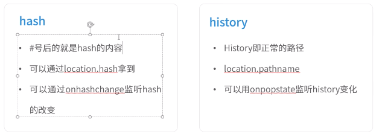
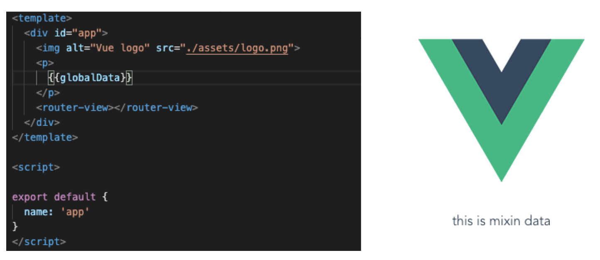

## 前端路由和后端路由

以前的很多技术，比如PHP，路由是直接发给后端，然后由后端根据路由返回对应的页面。但是现在的前端技术，比如Vue, React都用的前端路由了，就是用户输入的路由跟后端并不是对应的了，而是前端来处理路由了，然后由前端来发起对应的请求。前端路由，后端路由具体流程如下：

### 后端路由

```markdown
1. 输入url
2. 请求发送到服务器
3. 服务器解析请求的地址
4. 拿到对应的页面
5. 返回页面
```

### 前端路由

```markdown
1. 输入url
2. js解析地址
3. 找到地址对应的页面
4. 执行页面的js
5. 渲染页面
```

## Vue-Router工作流程

vue-router的工作流程有如下几步

```markdown
1. url改变
2. 触发监听事件
3. 改变vue-router里面的current变量
4. 监视current变量（变量的监视者）
5. 获取对应的组件
6. render新组件
```

Vue-Router的路由模式有两种：hash和history，这两种模式的监听方法不一样

### 监听url改变事件

hash模式的值可以通过`location.hash`拿到，监听改变可以使用`onhashchange`事件；history的值可以用`location.pathname`拿到，可以用`onpopstate`事件来监听改变。



### Vue插件

在使用Vue-Router之前我们都会调用下`Vue.use`，那`Vue.use`方法究竟是干嘛的呢？`Vue.use`方法接收一个对象作为参数，并且会运行这个对象的`install`方法，如果没有`install`方法会检查这个参数是不是方法，如果是方法就执行这个方法：

```javascript
function pluginA() {
  console.log(1);
}

pluginA.install = function() {
  console.log('install');
}

// pluginA如果没有install属性，执行本身，输出1
// 如果有install属性，执行install属性对应的方法，输出install
Vue.use(pluginA);  // console: install
```

要实现插件功能，关键是`Vue.use`在执行`install`方法的时候，会传一个参数`vue`进去，这个参数是Vue的类，可以通过这个参数调用vue的API：

```javascript
pluginA.install = function(vue) {
  console.log(vue);
}
```


我们要实现路由插件功能的关键是使用`vue.mixin`API，这个API可以将一些变量和方法全局混入Vue的实例，下面我们混入一个测试数据，并渲染到跟路由上：

```javascript
pluginA.install = function(vue) {
	vue.mixin({
    data() {
      return {globalData: 'this is mixin data'}
    }
  })
}
```

然后在所有路由上都可以直接使用这个变量了，跟路由也是，而不需要导入。



`vue.mixin`不仅可以混入变量和方法，还可以混入生命周期，在这里混入的生命周期在每个组件的这个生命周期的这个阶段都会调用：

```javascript
pluginA.install = function(vue) {
	vue.mixin({
    data() {
      return {globalData: 'this is mixin data'}
    },
    // 混入生命周期
    created() {
      console.log('I am global created');
    }
  })
}
```

需要注意的是，`new Vue`和`App.vue`也算两个组件，也会运行一次生命周期，在`/test`下只有一个Test组件的情况下，`I am global created`会打印三次，分别对应`new Vue`，`App.vue`和`Test`组件。在混入的方法或者生命周期里面可以拿到`this`，这个`this`分别指向对应的组件实例，很多插件特性都是靠这个实现的


为了实现我们的route插件，除了需要`vue.mixin`外，还需要`vue.util`，这是个工具类，里面主要有四个方法：

```markdown
1. warn： 抛出警告
2. extend：类似于Object.assign，一层拷贝，Object.assign有兼容问题，这个方法是一个for...in循环
3. mergeOptions:合并选项
4. defineReactive：这就是Vue实现响应式的核心代码，可以看看之前我讲Vue响应式的文章，里面会实现对对象get，set的监听，现在Vue通过util类将这个方法暴露出来了，我们可以用它来监听外部变量，这里主要是监听router的current变量。
```

`vue.util.extend`不同于`vue.extend`，`vue.extend`可以继承单个组件，然后渲染单个组件，可以用于单元测试

## 实现自己的Vue Router

前置知识都讲完了，下面正式开始写一个自己的vue router。第一步我们需要建一个history类，这个类很简单，只有一个属性，用来存储`current`。

```javascript
class HistoryRoute {
  constructor() {
    this.current = null;
  }
}
```

然后建一个主要的vueRouter类，这个类会有mode，history，routes三个属性，mode用来接收是hash模式还是history模式，history就是上面`HistoryRoute`的一个实例，routes是路由列表。构造函数里面还需要调用一个`init`方法，这个方法根据mode不同，注册不同的事件来监听路由变化，并将变化的路由存到`history.current`上。

```javascript
class vueRouter {
  constructor(options) {
    this.mode = options.mode || 'hash';
    this.routes = options.routes || [];
    this.history = new HistoryRoute();

    // 将数组结构的routes转化成一个更好查找的对象
    this.routesMap = this.mapRoutes(this.routes);
    this.init();
  }

  // 加载事件监听
  init() {
    if(this.mode === 'hash'){
      // 如果url没有hash，给一个默认的根目录hash
      location.hash ? '' : location.hash = '/';
      window.addEventListener('load', () => {
        // 页面加载的时候初始化，存储hash值到history的current上，并且去掉开头的#
        this.history.current = location.hash.slice('1');
      });
      window.addEventListener('hashchange', () => {
        // hash改变的时候更新history的current
        this.history.current = location.hash.slice('1');
      })
    } else {
      // else处理history模式
      // 如果url没有pathname，给一个默认的根目录pathname
      location.pathname ? '' : location.pathname = '/';
      window.addEventListener('load', () => {
        // 页面加载的时候初始化，存储pathname值到history的current上
        this.history.current = location.pathname;
      });
      window.addEventListener('popstate', () => {
        // pathname改变的时候更新history的current
        this.history.current = location.pathname;
      })
    }
  }

  /*
  将 [{path: '/', component: Hello}]
  转化为 {'/': Hello}
  */
  mapRoutes(routes) {
    return routes.reduce((res, current) => {
      res[current.path] = current.component;
      return res;
    }, {})
  }
}
```

最后需要给vueRouter一个`install`方法，这个方法是`vue.use`会调用的插件方法，这个方法里面需要将路由相关信息注入到vue里面去

```javascript
// 添加install属性，用来执行插件
vueRouter.install = function(vue) {
  vue.mixin({
    beforeCreate() {
      // 获取new Vue时传入的参数
      if(this.$options && this.$options.router) {
        this._root = this;
        this._router = this.$options.router;

        // 监听current, defineReactive(obj, key, val)不传第三个参数，第三个参数默认是obj[key]
        // 第三个参数传了也会被监听，效果相当于，第一个参数的子级
        vue.util.defineReactive(this, 'current', this._router.history);
      } else {
        // 如果不是根组件，就往上找
        this._root = this.$parent._root;
      }

      // 暴露一个只读的$router
      Object.defineProperty(this, '$router', {
        get() {
          return this._root._router;
        }
      })
    }
  });

  // 新建一个router-view组件，这个组件根据current不同会render不同的组件
  // 最终实现路由功能
  vue.component('router-view', {
    render(h){
      const current = this._self._root._router.history.current;
      const routesMap = this._self._root._router.routesMap;
      const component = routesMap[current];

      return h(component);
    }
  })
}
```

## 总结

其实上面的基础版vue router主要包括两部分，一部分是浏览器地址的监听，将url改变监听到并存入vueRouter类中，另一部分是将vueRouter与vue连接起来，这部分主要是靠vue的插件机制实现的。

这个例子的完整代码可以看我的github: 

